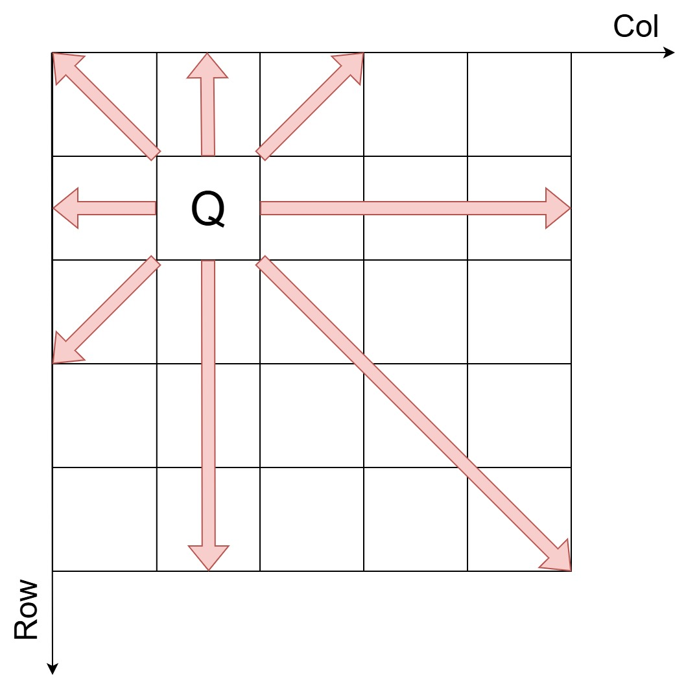
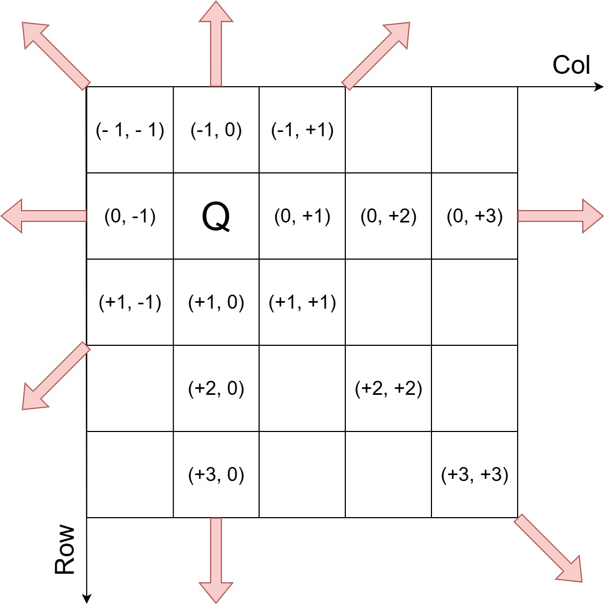

# Giới thiệu nhóm
Nhóm: 4 <br>
Môn: Hệ cơ sở tri thức <br>
Đề tài: Bài toán 8 quân hậu <br>
Danh sách thành viên:
| Stt   | Họ tên                | MSSV          | Ghi chú       |
| ---   | ---                   | ---           | ---           |
| 1     | Nguyễn Hoàng Ân       | KHDL2211012   | (Nhóm trưởng) |
| 2     | Huỳnh Thị Kim Cương   | KHDL2211043   |               |
| 3     | Phan Nguyễn Vũ Huy    | KHDL2211010   |               |
| 4     | Nguyễn Việt Khánh     | KHDL2211017   |               |
| 5     | Phạm Hữu Nhân         | KHDL2211015   |               |


# Giới thiệu đề tài
(pass)

# Yêu cầu
Có compile g++ và make

# Cấu trúc thư mục
<span>
. <br>
|-- _8_queens.cpp <br>
|-- _8_queens.h <br>
|-- test.cpp <br>
|-- main.cpp <br>
|-- Makefile <br>
File header (_8_queens.h): Mục đích là để khai báo, liên kết đến với các thư viện sẽ sử dụng, và tạo một khung cho file source. <br>
File source (_8_queens.cpp): Chứa mã lệnh để sử dụng trong việc giải quyết bài toán. <br>
File test.cpp, main.cpp: Dùng để kiểm thử và chạy kết quả cuối cùng. <br>
Makefile: Chứa lệnh biên dịch và chạy để không phải viết lại mỗi lần muốn kiểm thử. <br>
</span>

# Thư viện sử dụng
cstdio: Thực hiện các thao tác liên quan đến input/output theo kiểu C. <br>
cstdlib: Các công cụ hỗ trợ theo kiểu C như việc phân bổ, giải phóng bộ nhớ, chuyển string sang số. <br>
cassert: Dùng để debug, phát hiện lỗi. <br>
queue: Thư viện hàng chờ của C++.

# Hướng dẫn sử dụng
Tải các gói phát triển theo hệ điều hành
Debian/Ubuntu (Linux) mở terminal và nhập lệnh: <br>
```
sudo apt install build-essential
```

Windows cài theo hướng dẫn sau:
[Using GCC with MinGW](https://code.visualstudio.com/docs/cpp/config-mingw)

# Mô tả bài toán
(pass)

## Ý tưởng giải bài toán
Thuật toán được lựa chọn để sử dụng là backtracking, vì đơn giản, dễ hiểu nhất. Để có thể thực hiện backtracking thì cần ràng buộc. Từ mô tả bài toán sẽ có 4 ràng buộc. Giả sử có $board \in \mathbb{N}^{8 X 8}, board_{i,j} \in {0, 1}$ chỉ mang giá trị 0 (không có quân hậu) và 1 (có quân hậu), bài toán cần thỏa các ràng buộc sau: ràng buộc dòng, ràng buộc cột, ràng buộc chéo chính, ràng buộc chéo phụ. 

## Quan hệ giữa quân hậu và các hướng tấn công
Để có thể biểu diễn ràng buộc dưới dạng toán học cần phải xác định được mối quan hệ giữa quân hậu và các hướng tấn công trong không gian 2 chiều. Ví dụ sau đây là hướng tấn công của quân hậu trên bàn cờ 5 X 5, đặt tại hàng 2, cột 2.


Col sẽ mang chiều dương khi sang bên phải và row sẽ mang chiều dương khi tiến xuống dưới. Giả sử xem Q tại vị trí (x, y) là trung tâm và có khả năng tấn công tại vị trí A(a, b), thì Q có mối quan hệ với các hướng tấn công như sau:
- Theo đường ngang: Hướng tấn công sẽ theo hướng của col và x giữ tại chỗ. A(a, b) ~ Q(x, y + col). <br>
- Theo đường dọc: Hướng tấn công sẽ theo hướng của row và y giữ tại chỗ. A(a, b) ~ Q(x + row, y). <br>
- Theo đường chéo chính: Hướng tấn công theo đường chéo chính thì x ~ row và y ~ col. A(a, b) ~ Q(x + row, y + col). <br>
- Theo đường chéo phụ: Hướng tấn công theo đường chéo phụ thì x ~ row và y ~ - col. Vì col >= y trong mọi trường hợp, cho nên sẽ đặt col làm số trừ. A(a, b) ~ Q(x + row, col - y)

Trong mảng 2 chiều 8 X 8, khoảng cách tối đa mà quân hậu có thể di chuyển là 7.


## Biểu diễn ràng buộc trong toán học
Với mảng 2 chiều board đã mô tả và mối quan hệ giữa quân hậu và các hướng tấn công, ta có được ràng buộc như sau:
- Ràng buộc hàng: Mỗi hàng chỉ được chứa 1 con hậu, hay nói cách khác tổng số quân hậu trong mỗi hàng là 1. $\sum\limits_{j=1}^{8}{board_{i,j}}=1, \forall i$
- Ràng buộc cột: Tổng số quân hậu trong mỗi cột là 1. $\sum\limits_{i=1}^{8}{board_{i,j}}=1, \forall j$
- Ràng buộc đường chéo chính: Vì không tính vị trí chính quân hậu được đặt nên số bước di chuyển tối đa là 7. $\sum\limits_{\substack{i=j=1}}^{8}{board_{k,l}}= 1$ , với $max(1,x-i) \leq k \leq min(8,x+i)$ , $max(1, y-j)\leq l \leq min(8,y+j)$ , $-7 \leq i = j \leq 7$.
- Ràng buộc đường chéo phụ: Tương tự như ràng buộc đường chéo chính, nhưng l sẽ được tính theo cách khác.  $\sum\limits_{\substack{i=j=1}}^{8}{board_{k,l}}= 1$ , với $max(1,x-i) \leq k \leq min(8,x+i)$ , $max(1, 8-j)\leq l \leq min(8,8-j)$ , $-7 \leq i = j \leq 7$.

## Hạn chế về việc biểu diễn bàn cờ trong không gian nhị phân
Trước khi 
