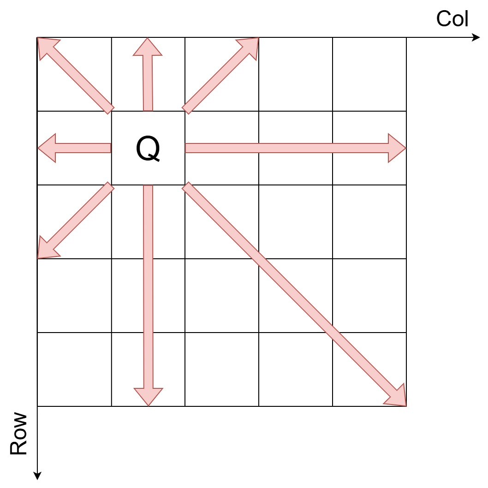
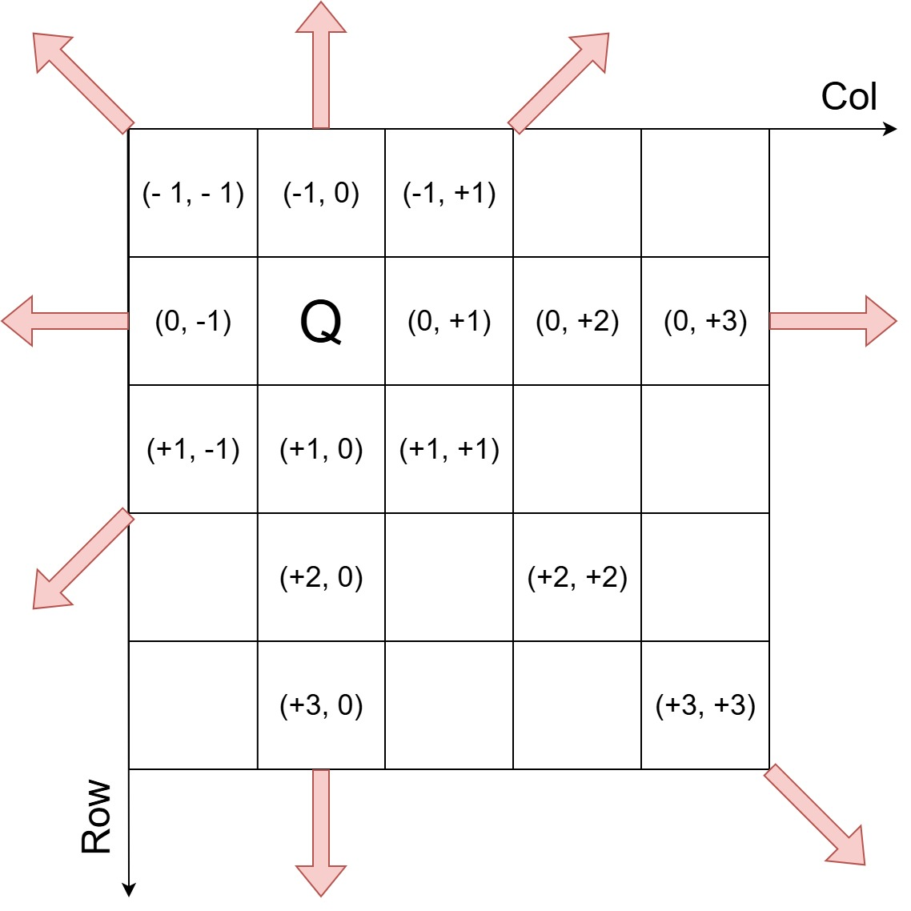
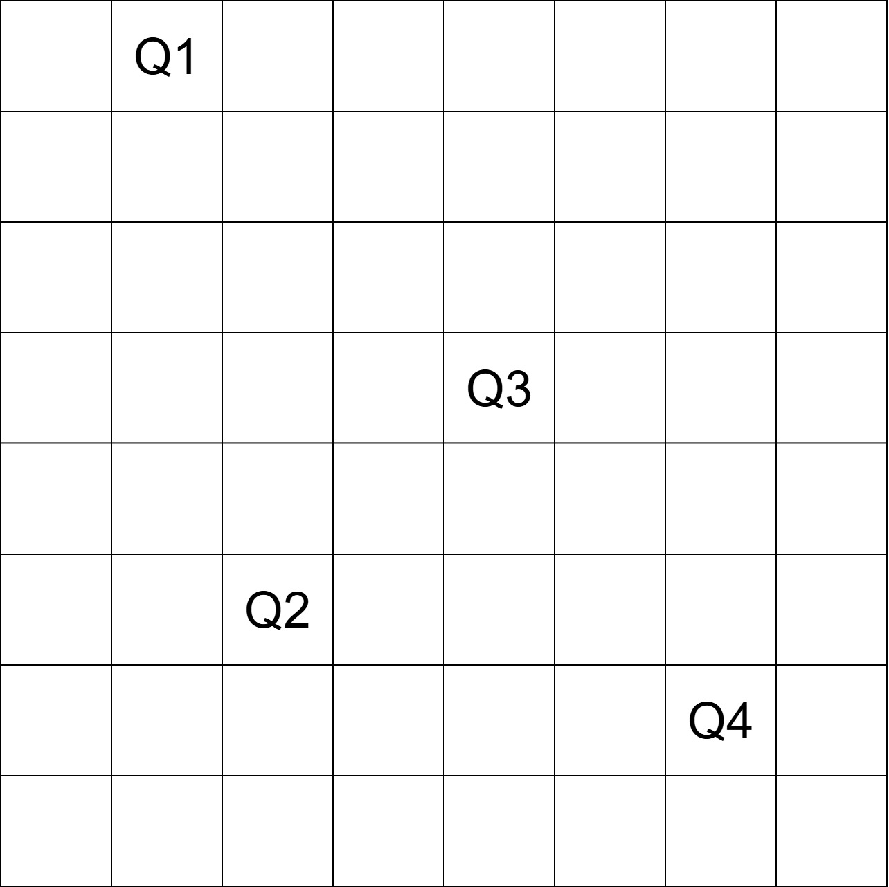
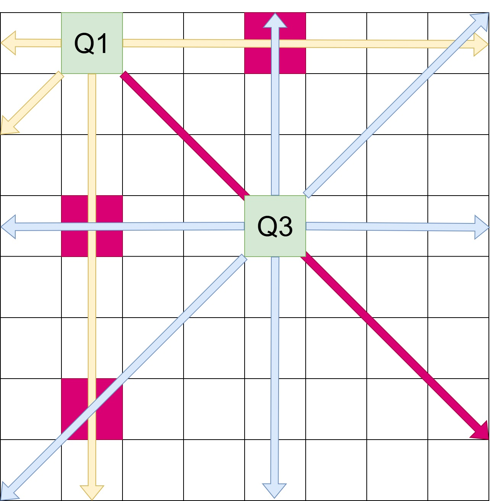
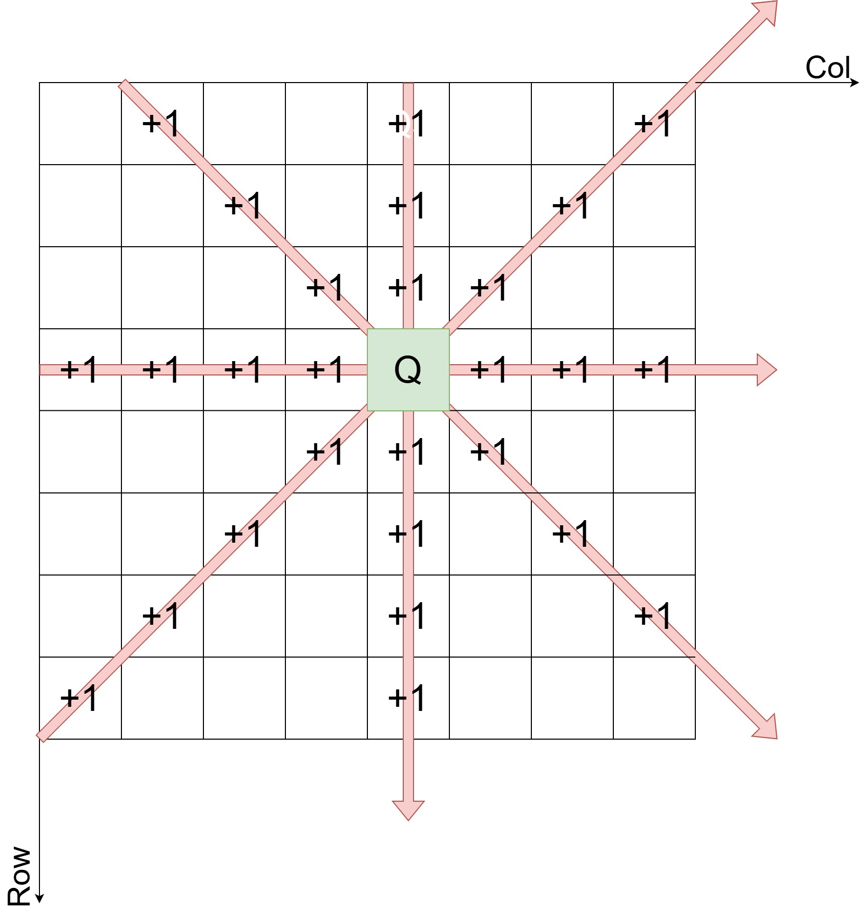

# Mục lục
1. [Giới thiệu nhóm](#giới-thiệu-nhóm)
2. [Cấu trúc thư mục](#cấu-trúc-thư-mục)
3. [Thư viện sử dụng](#thư-viện-sử-dụng)
4. [Hướng dẫn sử dụng](#hướng-dẫn-sử-dụng)
5. [Mô tả bài toán](#mô-tả-bài-toán)
6. [Ý tưởng bài toán](#ý-tưởng-giải-bài-toán)
    1. [Quan hệ giữa quân hậu và các hướng tấn công](#quan-hệ-giữa-quân-hậu-và-các-hướng-tấn-công)
    2. [Biểu diễn bàn cờ trong không gian số nguyên](#biểu-diễn-bàn-cờ-trong-không-gian-số-nguyên)
    3. [Cập nhật bàn cờ trong không gian số nguyên và ràng buộc](#cập-nhật-bàn-cờ-trong-không-gian-số-nguyên-và-ràng-buộc)
7. [Luật dẫn](#luật-dẫn)
    1. [Hàm in_bound](#hàm-inbound)
    2. [Hàm check](#hàm-check)
    3. [Hàm update](#hàm-update)
    4. [Hàm backtrack](#hàm-backtrack)
    5. [Kiểm tra input người dùng](#kiểm-tra-input-người-dùng)
    6. [Hàm solve](#hàm-solve)

# Giới thiệu nhóm
Nhóm: 4  
Môn: Hệ cơ sở tri thức  
Đề tài: Bài toán 8 quân hậu  
Danh sách thành viên:
| Stt   | Họ tên                | MSSV          | Ghi chú       |
| ---   | ---                   | ---           | ---           |
| 1     | Nguyễn Hoàng Ân       | KHDL2211012   | (Nhóm trưởng) |
| 2     | Huỳnh Thị Kim Cương   | KHDL2211043   |               |
| 3     | Phan Nguyễn Vũ Huy    | KHDL2211010   |               |
| 4     | Nguyễn Việt Khánh     | KHDL2211017   |               |
| 5     | Phạm Hữu Nhân         | KHDL2211015   |               |

# Cấu trúc thư mục

.  
|-- _8_queens.cpp  
|-- _8_queens.h  
|-- test.cpp  
|-- main.cpp  
|-- Makefile  
File header (_8_queens.h): Mục đích là để khai báo, liên kết đến với các thư viện sẽ sử dụng, và tạo một khung cho file source.  
File source (_8_queens.cpp): Chứa mã lệnh để sử dụng trong việc giải quyết bài toán.  
File test.cpp, main.cpp: Dùng để kiểm thử và chạy kết quả cuối cùng.  
Makefile: Chứa lệnh biên dịch và chạy để không phải viết lại mỗi lần muốn kiểm thử.  

# Thư viện sử dụng
cstdio: Thực hiện các thao tác liên quan đến input/output theo kiểu C.  
cstdlib: Các công cụ hỗ trợ theo kiểu C như việc phân bổ, giải phóng bộ nhớ, chuyển string sang số.  
cassert: Dùng để debug, phát hiện lỗi.  
queue: Thư viện hàng chờ của C++.

# Hướng dẫn sử dụng
Cài biên dịch  
Đối với Ubuntu/Debian:  
`sudo apt install build-essential`

Đối với Windows:
[Using GCC with MinGW](https://code.visualstudio.com/docs/cpp/config-mingw)

Biên dịch  
Sau khi đã cài g++, biên dịch bằng lệnh `g++ -o main main.cpp _8_queens.cpp`.

Chạy chương trình 
Đối với Debian/Ubuntu 
`./main {Hàng muốn đặt quân hậu đầu} {Cột muốn đặt quân hậu đầu}`

Đối với Windows 
`main.exe {Hàng muốn đặt quân hậu đầu} {Cột muốn đặt quân hậu đầu}`

# Mô tả bài toán
(pass)

# Ý tưởng giải bài toán
Thuật toán được lựa chọn để sử dụng là backtracking, vì đơn giản, dễ hiểu nhất. Để có thể thực hiện backtracking thì cần ràng buộc. Từ mô tả bài toán sẽ có 4 ràng buộc. Giả sử có $board \in \mathbb{N}^{8 X 8}, board_{i,j} \in \{0, 1\}$ chỉ mang giá trị 0 (không có quân hậu) và 1 (có quân hậu), bài toán cần thỏa các ràng buộc sau: ràng buộc dòng, ràng buộc cột, ràng buộc chéo chính, ràng buộc chéo phụ. 

## Quan hệ giữa quân hậu và các hướng tấn công
Để có thể biểu diễn ràng buộc cần phải xác định được mối quan hệ giữa quân hậu và các hướng tấn công trong không gian 2 chiều. Ví dụ sau đây là hướng tấn công của quân hậu trên bàn cờ 5 X 5, đặt tại hàng 2, cột 2.

Col sẽ mang chiều dương khi sang bên phải và row sẽ mang chiều dương khi tiến xuống dưới. Giả sử xem Q tại vị trí (x, y) là trung tâm và có khả năng tấn công tại vị trí A(a, b), thì Q có mối quan hệ với các hướng tấn công như sau:
- Theo đường ngang: Hướng tấn công sẽ theo hướng của col và x giữ tại chỗ. A(a, b) ~ Q(x, y + col).  
- Theo đường dọc: Hướng tấn công sẽ theo hướng của row và y giữ tại chỗ. A(a, b) ~ Q(x + row, y).  
- Theo đường chéo chính: Hướng tấn công theo đường chéo chính thì x ~ row và y ~ col. A(a, b) ~ Q(x + row, y + col).  
- Theo đường chéo phụ: Hướng tấn công theo đường chéo phụ thì x ~ row và y ~ - col. Vì col >= y trong mọi trường hợp, cho nên sẽ đặt col làm số trừ. A(a, b) ~ Q(x + row, col - y)

Trong mảng 2 chiều 8 X 8, khoảng cách tối đa mà quân hậu có thể di chuyển là 7.

## Biểu diễn bàn cờ trong không gian số nguyên
Một trong những hạn chế của việc biểu diễn trong không gian nhị phân là khó diễn giải các ô có thể tấn công. Giả sử có bàn cờ 8 X 8, với 4 con hậu. Ô chứa con hậu sẽ mang giá trị 1 trong khi đó ô trống mang giá trị 0. Từ hình ảnh sau, nếu muốn xét vị trí có khả năng đặt quân hậu cần phải xét cả 4 ràng buộc như trên rất khó để diễn giải. Cặp hậu Q1 - Q3 sẽ tấn công lẫn nhau. 

Để có thể giải quyết vấn đề trên, giải pháp được đặt ra là chuyển bàn cờ sang không gian số nguyên. Nếu đặt, hoặc gỡ sẽ cộng hoặc trừ 1 đơn vị. Như vậy có thể biễu diễn tri thức dễ hiểu hơn. Như hình sau đây biểu diễn hướng tấn công của quân hậu, màu nhạt thể hiện hướng tấn công của Q1 (vàng) và Q3 (lam). Ô và hướng màu đậm thể hiện tấn công trùng lặp. Ví dụ đặt quân hậu tại các vị trí sau:
- (3, 1): Sẽ không bị quân hậu nào tấn công.
- (1, 1): Bị Q1 tấn công.
- (4, 2): Bị cả Q1 lẫn Q3 tấn công.

## Cập nhật bàn cờ trong không gian số nguyên và ràng buộc
Nếu sử dụng không gian số nguyên thì chính trạng thái bàn cờ là ràng buộc và cũng là kết quả của bài toán. Cộng/trừ các hàng, cột, đường chéo đại diện cho việc đặt hoặc gỡ quân hậu. Trong đề tài này sẽ sử dụng (+) để biểu thị việc đặt quân hậu. Giả sử có bàn cờ 8X8, con hậu tại vị trí (4, 5). Những vị trí biểu thị (+1) là bị con hậu Q tấn công, những vị trí còn lại đều đặt được. Nếu gỡ quân hậu thì chỉ cần -1 lại. Do quân hậu được cập nhật 4 lần, nên cần trừ 3 hoặc là bỏ qua cập nhật vị trí trung tâm. Như hình sau, vị trí quân hậu Q sẽ mang giá trị 4.

### Cập nhật hàng, cột
Cập nhật hàng và cột thì tương đối đơn giản. Với $i \in \{1 .. 8\}$.
Cập nhật đối với hàng: `board[row, i] += 1`
Cập nhật đối với cột: `board[i, col] += 1`

### Cập nhật chéo
Đối với cập nhật đường chéo thì hơi phức tạp hơn. Do bàn cờ có thước 8X8, cho nên số bước tối đa mà có thể duyệt là 7. 
Cập nhật chéo chính `board[pos_row, pos_col] += 1`. Với $pos_row = row + i, pos_col = col + i, pos\_row \in {1 .. 8}, pos\_col \in {1 .. 8}$
Cập nhật chéo chính `board[pos_row, pos_col] += 1`. Với $pos_row = row + i, pos_col = col - i, pos\_row \in {1 .. 8}, pos\_col \in {1 .. 8}$

### Kiểm tra vị trí đặt quân hậu
Sau khi cập nhật trạng thái chỉ cần kiểm tra vị trí đó có mang giá trị 0 (không bị tấn công) hay không. `board[row][col] == 0`.

# Luật dẫn
Luật được viết sau đây sẽ dựa trên code thay vì lý thuyết, tức là sẽ dùng chỉ số (0 -> 7).

## Hàm inbound
**R1**: 
IF $0 \leq value \leq 7$ 
THEN in_bound(value) <- true

## Hàm check
**R2**: 
IF board[row][col] = 0 
THEN check(row, col) <- true

## Hàm update
**R3**: 
board[row][col] <- board[row][col] -  3*sign 
$\forall i \in \lbrace 1..8 \rbrace$ 
board[row][i] <- board[row][i] + sign 
board[i][col] <- board[i][col] + sign

**R4**: 
$\forall i \in \lbrace -7..7 \rbrace$ 
poss_row <- row + i 

poss_col <- col + i 
IF  in_bound(poss_row) 
    AND in_bound(poss_col) 
THEN board[poss_row][poss_col] <- board[poss_row][poss_col] + sign 

poss_col <- col - i 
IF  in_bound(poss_row) 
    AND in_bound(poss_col) 
THEN board[poss_row][poss_col] <- board[poss_row][poss_col] + sign 

