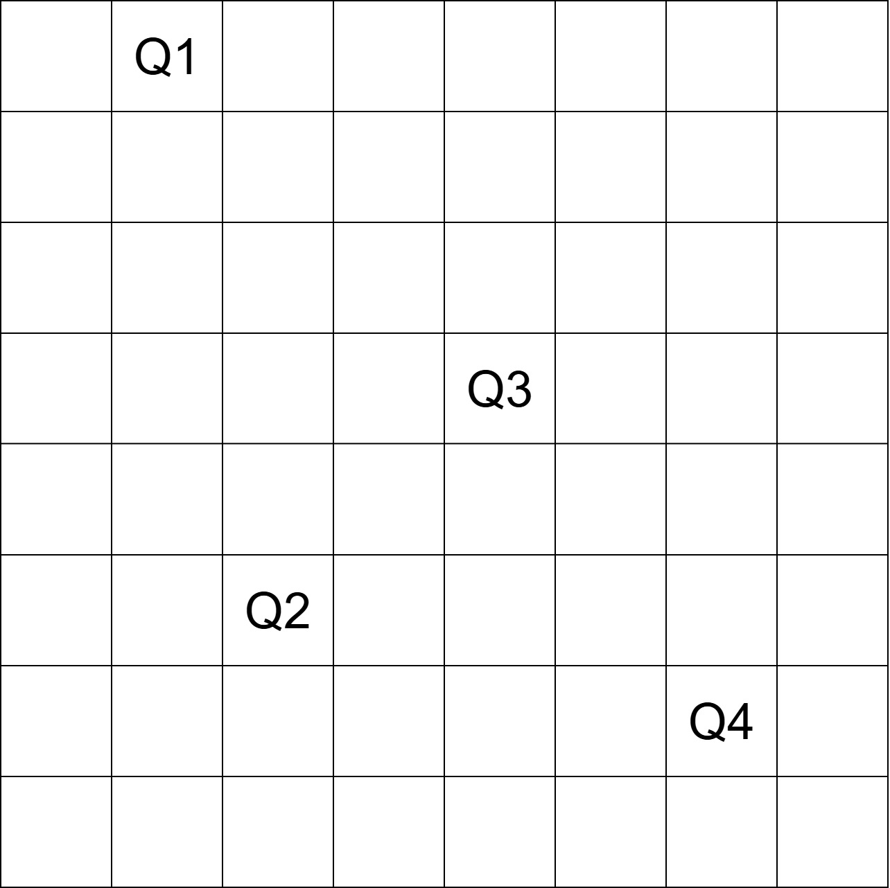
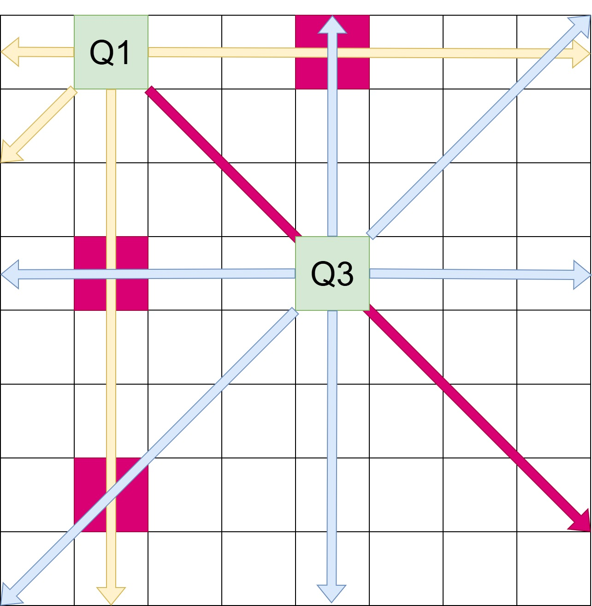

# Giới thiệu nhóm
Nhóm: 4 <br>
Môn: Hệ cơ sở tri thức <br>
Đề tài: Bài toán 8 quân hậu <br>
Danh sách thành viên:
| Stt   | Họ tên                | MSSV          | Ghi chú       |
| ---   | ---                   | ---           | ---           |
| 1     | Nguyễn Hoàng Ân       | KHDL2211012   | (Nhóm trưởng) |
| 2     | Huỳnh Thị Kim Cương   | KHDL2211043   |               |
| 3     | Phan Nguyễn Vũ Huy    | KHDL2211010   |               |
| 4     | Nguyễn Việt Khánh     | KHDL2211017   |               |
| 5     | Phạm Hữu Nhân         | KHDL2211015   |               |


# Giới thiệu đề tài
(pass)

# Cấu trúc thư mục
<span>
. <br>
|-- _8_queens.cpp <br>
|-- _8_queens.h <br>
|-- test.cpp <br>
|-- main.cpp <br>
|-- Makefile <br>
File header (_8_queens.h): Mục đích là để khai báo, liên kết đến với các thư viện sẽ sử dụng, và tạo một khung cho file source. <br>
File source (_8_queens.cpp): Chứa mã lệnh để sử dụng trong việc giải quyết bài toán. <br>
File test.cpp, main.cpp: Dùng để kiểm thử và chạy kết quả cuối cùng. <br>
Makefile: Chứa lệnh biên dịch và chạy để không phải viết lại mỗi lần muốn kiểm thử. <br>
</span>

# Thư viện sử dụng
cstdio: Thực hiện các thao tác liên quan đến input/output theo kiểu C. <br>
cstdlib: Các công cụ hỗ trợ theo kiểu C như việc phân bổ, giải phóng bộ nhớ, chuyển string sang số. <br>
cassert: Dùng để debug, phát hiện lỗi. <br>
queue: Thư viện hàng chờ của C++.

# Hướng dẫn sử dụng
Để có thể chạy chỉ cần dùng `./main <Vị trí đặt quân hậu>`. Ví dụ: `./main 1`.

(Tùy chọn) Biên dịch đề tài
Cài đặt compile g++ theo hướng dẫn sau 
Debian/Ubuntu (Linux) mở terminal và nhập lệnh: <br>
```
sudo apt install build-essential
```

Windows cài theo hướng dẫn sau:
[Using GCC with MinGW](https://code.visualstudio.com/docs/cpp/config-mingw)

Sau khi đã cài g++, biên dịch bằng lệnh `g++ -o <tên file> main.cpp _8_queens.cpp`.
# Mô tả bài toán
(pass)

# Ý tưởng giải bài toán
Thuật toán được lựa chọn để sử dụng là backtracking, vì đơn giản, dễ hiểu nhất. Để có thể thực hiện backtracking thì cần ràng buộc. Từ mô tả bài toán sẽ có 4 ràng buộc. Giả sử có $board \in \mathbb{N}^{8 X 8}, board_{i,j} \in {0, 1}$ chỉ mang giá trị 0 (không có quân hậu) và 1 (có quân hậu), bài toán cần thỏa các ràng buộc sau: ràng buộc dòng, ràng buộc cột, ràng buộc chéo chính, ràng buộc chéo phụ. 

## Quan hệ giữa quân hậu và các hướng tấn công
Để có thể biểu diễn ràng buộc dưới dạng toán học cần phải xác định được mối quan hệ giữa quân hậu và các hướng tấn công trong không gian 2 chiều. Ví dụ sau đây là hướng tấn công của quân hậu trên bàn cờ 5 X 5, đặt tại hàng 2, cột 2.


Col sẽ mang chiều dương khi sang bên phải và row sẽ mang chiều dương khi tiến xuống dưới. Giả sử xem Q tại vị trí (x, y) là trung tâm và có khả năng tấn công tại vị trí A(a, b), thì Q có mối quan hệ với các hướng tấn công như sau:
- Theo đường ngang: Hướng tấn công sẽ theo hướng của col và x giữ tại chỗ. A(a, b) ~ Q(x, y + col). <br>
- Theo đường dọc: Hướng tấn công sẽ theo hướng của row và y giữ tại chỗ. A(a, b) ~ Q(x + row, y). <br>
- Theo đường chéo chính: Hướng tấn công theo đường chéo chính thì x ~ row và y ~ col. A(a, b) ~ Q(x + row, y + col). <br>
- Theo đường chéo phụ: Hướng tấn công theo đường chéo phụ thì x ~ row và y ~ - col. Vì col >= y trong mọi trường hợp, cho nên sẽ đặt col làm số trừ. A(a, b) ~ Q(x + row, col - y)

Trong mảng 2 chiều 8 X 8, khoảng cách tối đa mà quân hậu có thể di chuyển là 7.


## Biểu diễn ràng buộc trong toán học
Với mảng 2 chiều board đã mô tả và mối quan hệ giữa quân hậu và các hướng tấn công, ta có được ràng buộc như sau:
- Ràng buộc hàng: Mỗi hàng chỉ được chứa 1 con hậu, hay nói cách khác tổng số quân hậu trong mỗi hàng là 1. $\sum\limits_{j=1}^{8}{board_{i,j}}=1, \forall i$
- Ràng buộc cột: Tổng số quân hậu trong mỗi cột là 1. $\sum\limits_{i=1}^{8}{board_{i,j}}=1, \forall j$
- Ràng buộc đường chéo chính: Vì không tính vị trí chính quân hậu được đặt nên số bước di chuyển tối đa là 7. $\sum\limits_{\substack{i=j=1}}^{8}{board_{k,l}}= 1$ , với $max(1,x-i) \leq k \leq min(8,x+i)$ , $max(1, y-j)\leq l \leq min(8,y+j)$ , $-7 \leq i = j \leq 7$.
- Ràng buộc đường chéo phụ: Tương tự như ràng buộc đường chéo chính, nhưng l sẽ được tính theo cách khác.  $\sum\limits_{\substack{i=j=1}}^{8}{board_{k,l}}= 1$ , với $max(1,x-i) \leq k \leq min(8,x+i)$ , $max(1, 8-j)\leq l \leq min(8,8-j)$ , $-7 \leq i = j \leq 7$.

## Hạn chế về việc biểu diễn bàn cờ trong không gian nhị phân
Một trong những hạn chế của việc biểu diễn trong không gian nhị phân là khó diễn giải các ô có thể tấn công. Giả sử có bàn cờ 8 X 8, với 4 con hậu. Ô chứa con hậu sẽ mang giá trị 1 trong khi đó ô trống mang giá trị 0. Từ hình ảnh sau, nếu muốn xét vị trí có khả năng đặt quân hậu cần phải xét cả 4 ràng buộc như trên rất khó để diễn giải. Cặp hậu Q1 - Q3 sẽ tấn công lẫn nhau. 


Để có thể giải quyết vấn đề trên, giải pháp được đặt ra là chuyển bàn cờ sang không gian số nguyên. Nếu đặt, hoặc gỡ sẽ cộng hoặc trừ 1 đơn vị. Như vậy có thể biễu diễn tri thức dễ hiểu hơn. Như hình sau đây biểu diễn hướng tấn công của quân hậu, màu nhạt thể hiện hướng tấn công của Q1 (vàng) và Q3 (lam). Ô và hướng màu đậm thể hiện tấn công trùng lặp. Ví dụ đặt quân hậu tại các vị trí sau:
- (3, 1): Sẽ không bị quân hậu nào tấn công.
- (1, 1): Bị Q1 tấn công.
- (4, 2): Bị cả Q1 lẫn Q3 tấn công.


Để thống nhất, chúng em sẽ cho các ô bị tấn công mang giá trị âm.

## Kiểm tra vị trí đặt quân hậu hợp lệ
Nếu biểu diễn bàn cờ trong không gian số nguyên, vị trí an toàn để đặt quân hậu sẽ có giá trị = 0.

## Lý thuyết giải bài toán
Quá trình đặt quân hậu bao gồm: Cập nhật trạng thái bàn cờ bằng cách trừ các ô mà quân hậu vừa đặt có thể tấn công và thêm kết quả.<br>
Quá trình gỡ quân hậu bao gồm: Cập nhật trạng thái bàn cờ bằng cách cộng các ô mà quân hậu vừa gỡ có thể tấn công và gỡ kết quả. <br>
Đặt quân hậu đầu tiên tại vị trí (1, start_col) với start_col là cột do người dùng tự chọn $1 \leq start_col \leq 8$. <br>
Duyệt hàng tiếp theo, bắt đầu ở ô đầu tiên, nếu giá trị tại ô đó = 0 thì đặt quân hậu vầ tiếp đến hàng tiếp theo cho đến khi duyệt hết hàng. <br>
Nếu duyệt hết các ô tại một hàng mà không tìm thấy kết quả thì lấy vị trí cuối cùng vừa lưu, và tiến đến ô tiếp theo chưa được duyệt.

# Xây dựng mã nguồn
Code sẽ bao gồm 3 hàm chính để giải và 1 hàm phụ:
- Hàm update dùng để cập nhật trạng thái bàn cờ
- Hàm check dùng để kiểm tra vị trí đang xét của quân hậu
- Hàm solve chứa thuật toán backtracking để giải
- Hàm print_board dùng để in trạng thái bàn cờ và vị trí đặt quân hậu
Trong phân xây dựng mã nguồn sẽ sử dụng index (0->7).<br>
Phần giải thích còn lại đều trong mã nguồn.